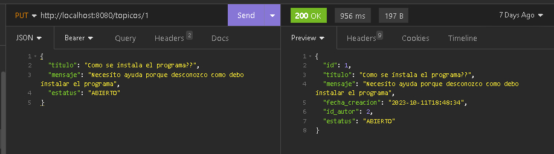

# :busts_in_silhouette: Foro Alura - Challenge ONE G5

### :bookmark_tabs: Descripcion

Este proyecto fue desarrollado en Java con el propósito de crear una API REST funcional para un foro de discusiones, el Foro Alura, siendo el cuarto y último Challenge de Oracle Next Education. Éste incluye funcionalidades para moderadores, usuarios, cursos, temas y respuestas. Para lograr esto, se implementó un sistema CRUD que permite la manipulación de datos a través de operaciones POST, GET, PUT y DELETE.

La aplicación se construyó utilizando Spring Boot y sus dependencias, empleando Spring Initializr como herramienta de inicio. Se conecta a una base de datos MySQL, y las migraciones se gestionan de manera efectiva mediante Flyway. Para garantizar la seguridad y autorización de las operaciones, se implementa un sistema de autenticación basado en JSON Web Tokens (JWT), utilizando Bearer tokens.

Además, el proyecto se encarga de validar los datos manipulados a través de filter-chains y manejo de excepciones, asegurando la integridad de la información y el correcto funcionamiento del foro de discusiones.

### :star: Insignia Spring 

<a src="https://d335luupugsy2.cloudfront.net/cms%2Ffiles%2F10224%2F1673890737Prancheta_9.png?utm_campaign=alura_latam_-_challenge_email_projeto_8_esp&utm_medium=email&utm_source=RD+Station"></a>

- ### :computer: Tecnologías utilizadas:

    - [Intellij IDEA](https://www.jetbrains.com/es-es/idea/)
    - [Java 17](https://www.java.com/en/)
    - [Spring Boot](https://start.spring.io/)
    - [MySQL Workbench](https://www.mysql.com/products/workbench/)
    - [XAMPP](https://www.apachefriends.org/es/index.html)
    - [Insomnia](https://insomnia.rest/)
    - [Flyway Schema](https://flywaydb.org/)
    - [Swagger UI](https://swagger.io/tools/swagger-ui/)
    - [Token JWT](https://jwt.io/)

### :open_file_folder: Diagrama de la base de datos


## :question: Cómo usar el conversor

<b>1.</b> Clonar el proyecto, empieza por clonar el repositorio en tu máquina local usando el siguiente comando:
```
git clone https://github.com/DanielHerrer/Challenge-Oracle-ONE-G5-ForoAlura
```
<b>2.</b> Importar el proyecto, abre el IDE y selecciona "File" -> "Open" para abrir el proyecto clonado.

<b>3.</b> Encender el servidor, asegúrate de que tu servidor de base de datos esté activo. Dependiendo de tus preferencias y configuración, puedes utilizar SQL Server o XAMPP (enciende MySQL y apaga Tomcat).

<b>4.</b> Ejecuta la consulta CREATE para la creacion del esquema de la base de datos, desde el archivo [ scripts_sql_foro_alura.sql ].

<b>5.</b> Configurar la Base de Datos, asegúrate de configurar las credenciales de conexión en el archivo [ api/src/main/resources/application.yml ].

<b>6.</b> Ejecutar la Aplicación, ejecuta la aplicación Spring desde el main [ api/src/main/java/alura/foro/api/ApiApplication.java ].

<b>7.</b> Ejecuta la consulta INSERT para la inserción del moderador con su clave previamente encriptada, desde el archivo [ scripts_sql_foro_alura.sql ].

<b>8.</b> Acceder a la API, Una vez que la aplicación esté en funcionamiento, puedes interactuar con la API REST de las siguientes maneras:

  - Utilizando una herramienta de cliente HTTP (como <b>Insomnia</b> o <b>Postman</b>) para realizar solicitudes a la API. Utiliza la dirección <a>http://localhost:8080/</a> (o la URL que hayas configurado) como punto de acceso.

:key: <b>Login</b>
<br>
:green_book: <b>POST</b>
<br>
:blue_book: <b>GET</b>
<br>
:orange_book: <b>PUT</b>
<br>
:closed_book: <b>DELETE</b>


  - Accediendo a la documentación de la API a través de <b>Swagger UI</b>. Puedes explorar la documentación interactiva de la API que te permite entender el funcionamiento y probar las solicitudes desde la URL <a>http://localhost:8080/swagger-ui.html</a> en tu navegador.

:books: <b>Controllers Swagger (Login, POST, GET, PUT, DELETE)</b>


**Developer** :shipit:


**Daniel Franco Herrera**<br>
[<sub>GitHub</sub>](https://github.com/DanielHerrer)<br>
[<sub>LinkedIn</sub>](https://www.linkedin.com/in/danielfrancoherrera/)
  